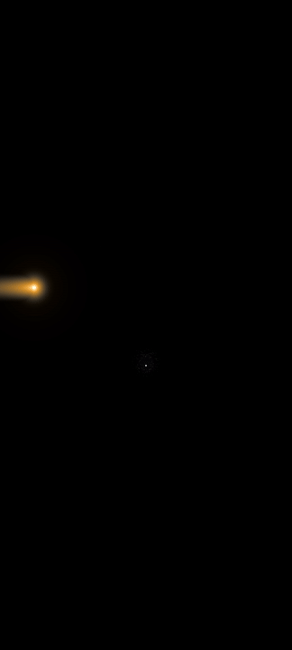

# Cathode-AGSL: Advanced CRT Simulation Engine

**Cathode-AGSL** is a high-fidelity post-processing engine for Android Jetpack Compose that physically emulates the behavior of Cathode Ray Tube (CRT) monitors and the thermal reaction of phosphor. 

Unlike traditional "overlay" filters, this engine transforms flat digital interfaces into an organic, unstable, and immersive analog medium by processing every pixel through a dual-stage **AGSL (Android Graphics Shading Language)** pipeline.

--

| CRT + text Laser displayer shaders   | CRT shader over text (scroll demo) | CRT shader single picture with edgy config | Thermal Reveal Sub-Shader |
|:---:|:---:|:---:|:---:|
|  |  |  |  |

| CRT shader over pictures gallery | CRT shader fast tweak panel | Signal Jitter & H-Sync Instability | Spherical Lens Distortion |
|:---:|:---:|:---:|:---:|
|  |  |  |  |

---

## The Rendering Pipeline

The engine operates as a "Sandwich of Shaders," decoupling UI logic from physical representation:

1. **The Source (Payload):** Standard Jetpack Compose UI (Text, Images, Layouts).
2. **Thermal Layer (Sub-Shader):** Applied locally to content to simulate incandescence and "writing" physics.
3. **Cathode Master (Global Shader):** The final "lens" that warps the entire output and adds the characteristic analog noise and signal instability.

---

## Deep Dive: The Master Shader (crt_lens.agsl)

The Master Shader acts as the final physical lens of the monitor. It processes the buffer through several mathematical layers:

### 1. Signal Jitter & H-Sync Instability
The engine simulates analog signal degradation using stochastic noise:
* **Global Jitter:** A brutal horizontal shift of the entire frame. It uses a high-frequency `fract(sin(time))` noise to trigger random signal "snaps."
* **Line Jitter:** Simulates a faulty horizontal synchronization (H-Sync). By targeting specific Y-coordinates (`floor(baseCoord.y * 0.1)`), it creates localized "tearing" effects that respond to the `time` variable.

### 2. Spherical Lens Distortion (The "Tube" Effect)
To replicate the convex glass of a 1980s monitor, the shader warps the UV coordinate space:
* **The Math:** It calculates the squared distance (`r2 = dot(uv, uv)`) from the screen's center.
* **The Warp:** By multiplying the coordinates by `(1.0 + FISH_EYE_STRENGTH * r2)`, the engine creates a non-linear magnification toward the edges, effectively "bending" the light.

### 3. Shadow Mask & Anaglyph Convergence
* **Phosphor Grid:** A sub-pixel grid (`GRID_SPACING`) is mathematically generated. It uses a `step()` function on the coordinate fractals to create a persistent mask of RGB phosphor dots.
* **RGB Aberration:** The shader performs a "Triple Sampling" strategy. It evaluates the source texture three times with slight horizontal offsets, mimicking the misalignment of the electron guns (Shadow Mask convergence errors).

---

## Thermal Reveal Sub-Shader (text_reveal_optical.agsl)

This component is a **material simulation**. It treats the UI as a physical surface being struck by a high-energy electron beam.

### 1. Thermal Persistence (Heat Decay)
A real-time heat map is calculated to simulate phosphor persistence:
* **Spatial Heat:** A Gaussian-like decay centered at the cursor.
* **Horizontal Trail:** The engine tracks the cursor's velocity vector and generates a `horizontalHeat` trail. This mimics the "afterglow" effect where the phosphor remains hot after the beam has passed.

### 2. Incandescence Logic
The text color isn't static; it follows a temperature gradient:
* **The "Phare" Effect:** Using `pow(heat, CORE_PWR)`, the shader concentrates light at the impact point, creating a pure white "hot core" that bleeds into a saturated neon blue glow.
* **Local Wave Distortion:** High heat levels trigger a local sine-wave distortion (`WAVE_SPEED`), simulating the visual ripple caused by high-voltage beam intensity.

---

## Physical Parameters (Uniforms)

The engine exposes "physical knobs" for real-time aesthetic control:

| Uniform | Concept | Impact |
| :--- | :--- | :--- |
| `FISH_EYE_STRENGTH` | Lens Curvature | Controls the convex depth of the CRT glass. |
| `JITTER_INTENSITY` | Signal Quality | Adjusts the frequency and strength of analog tearing. |
| `TRAIL_LENGTH` | Phosphor Decay | Defines how long the "light ghosting" lasts behind the laser. |
| `CORE_PWR` | Beam Intensity | Higher values create a sharper, more incandescent impact. |
| `ANAGLYPH_SHIFT` | Color Convergence | Simulates the physical alignment of RGB electron guns. |

---

## Target Hardware & Calibration (The Pixel 7 / 120Hz Standard)

**Cathode-AGSL** is precision-engineered for high-end mobile displays, specifically calibrated on **Google Pixel 7** hardware. 

### The 120Hz Requirement
The temporal effects—specifically the `Line Jitter`, `Global Flicker`, and the `Thermal Reveal` trail—are mathematically tuned for a **120Hz refresh rate**. 
* **Persistence:** The `TRAIL_LENGTH` and decay functions rely on the rapid frame budget (8.33ms) to create a fluid, ghost-free analog trail.
* **Flicker:** The high-frequency screen pulse (`flicker`) is designed to be perceived as a "texture" at 120Hz. 

### OLED & Pixel Density
The rendering quality is optimized for **OLED panels**:
* **True Blacks:** The "Alpha 1.0 Proof" strategy and the `BG_EDGE_COLOR` rely on the absolute black of OLED pixels to simulate the depth of a physical CRT tube.
* **Hardware Degradation:** Any attempt to run this engine on lower-tier hardware (LCD panels, 60Hz displays, or lower-end GPUs) will result in a **fatal loss of fidelity**:
    * **60Hz:** The jitter and scanlines may appear "stuttery" or cause visual fatigue (aliasing).
    * **LCD:** The "vacuum" effect of the monitor will lose its depth due to backlight bleeding.
    * **Mid-range GPUs:** The heavy `dot()` and `exp()` math per pixel may cause thermal throttling and drop the frame rate below the threshold of fluid analog simulation.

> **Note:** This is a "Hardware-First" design. It pushes the boundaries of AGSL by assuming the device has the raw power to handle per-pixel physics at 120 frames per second.

---

## Performance & Optimization (AGSL Logic)

Running complex physics like spherical distortion and thermal trails on every frame requires a deep understanding of the Android Graphics Pipeline. **Cathode-AGSL** is optimized to run at 60/120Hz by leveraging the GPU for all math-heavy operations.

### The "Pros" (Optimization Wins)

* **Hardware Accelerated:** All effects (Distortion, Jitter, Color Shifting) are computed in a single GPU pass. AGSL compiles directly to Vulkan/OpenGL shading language, ensuring near-native performance.
* **UI Thread Decoupling:** The "heavy lifting" is done in the `RenderEffect` layer. The Main Thread only handles simple float updates (time, cursor position), preventing any frame drops during complex UI interactions.
* **Resolution Independent:** Since the shaders use normalized coordinates (UV) and mathematical functions (`sin`, `exp`, `dot`), the CRT effect remains sharp and consistent on any screen density (LDPI to XXXHDPI).
* **Additive Blending:** The "Thermal Reveal" uses a smart alpha-proof merge, allowing the laser glow to sit on top of the background grid without causing expensive overdraw or black-pixel artifacts.

### The "Cons" (Technical Constraints)

* **GPU Thermal Load:** While efficient, applying the Master Shader to the entire screen on high-resolution devices (4K) can increase battery consumption due to the per-pixel math (especially the `dot()` and `exp()` calls).
* **Coordinate Precision:** The `Line Jitter` and `Shadow Mask` depend on precise pixel alignment. On some non-standard aspect ratios, slight moiré patterns can appear if the `GRID_SPACING` isn't perfectly tuned.
* **AGSL Exclusivity:** This engine requires **Android 13 (API 33)** or higher. It is not backward compatible with older RenderNode systems, making it a "bleeding-edge" UI library.
* **Input Latency:** Because the shader "reveals" the text based on a cursor position tracked by Compose, a very slight (1-frame) lag can exist between the logical text update and the visual "burn," though it is often perceived as part of the analog "lag" aesthetic.

---

## Advanced Usage: Real-time Injection

To maintain 120Hz fluidity, the engine uses `RuntimeShader.setFloatUniform`. This allows you to animate the "Analog Chaos" from Kotlin code:

- **Glitch Bursts:** Trigger `JITTER_INTENSITY` spikes during "System Errors".
- **Power Down:** Animate `SCREEN_ZOOM` and `FISH_EYE_STRENGTH` to zero to simulate a monitor turning off.
- **Dynamic Heat:** Link `laserIntensity` to the typing speed for a more aggressive glow.

---

## Philosophy: "Digital Materialism"

The goal of **Cathode-AGSL** is to achieve "Digital Materialism." Instead of viewing UI as a collection of pixels, we treat it as a physical interaction between electrons and matter. This decoupling allows developers to build clean, functional UIs while the engine breathes physical, analog life into them.
